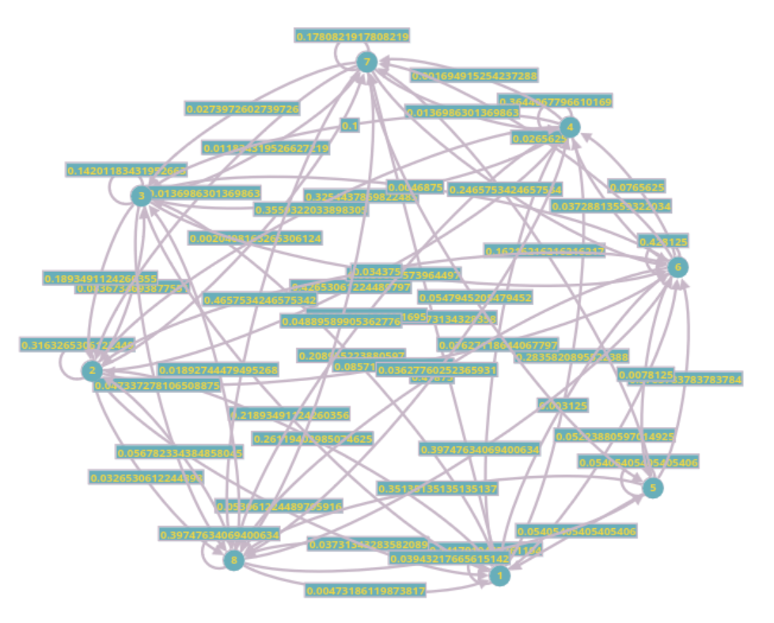

+++
title = 'Markov Chains & Modelling'
date = 2024-12-21T00:57:38-05:00
tags = ['markov']
draft = false
+++
I've been hearing of Markov Chains for a few years, never got to read about them or something with them. This is my look at them. The sole goal of this post is to get a good look at how Markov Chains work, we are going to do this by attempting to model some stock data. This post is initially written as a paper for a course I took.

<!-- This is the structure of the post: -->
<!-- - [Introduction](#introduction) -->
<!--     - Intro to what markov chains are, and look at the data we are using and the modelling task. -->
<!-- - [Discretization](#discretization-considerations) -->
<!--     - How we are going to take some continous data and discretize it, and why. -->
<!-- - [Initial Markov Model](#initial-markov-model) -->
<!--     - A Basic Model with only a few states, and how that performs against the base line. -->
<!-- - [Evaluation](#evaluation-methodology) -->
<!--     - How we are going to compare these models, and what the measure is. -->
<!-- - [Intial Model: Performance & Comments](#initial-model-and-comments) -->
<!--     - Some comments about performance of the intial model. -->
<!-- - [Improvements & Remarks](#improvements) -->
<!---->
<!---->
<!-- ## Abstract -->
<!-- Two goals of this paper are to detail out an algorithm to predict price of a stock for the next day and another algorithm that takes two stock charts and measures the similarity between two stock charts \(\alpha\) and \(\beta\). The paper is going to predominantly rely on the use of Markov chain based modeling to predict and compare the stocks. We also proposed a back testing methodology to test how good the models are for prediction. We are getting the charts from Yahoo finance.  -->
<!---->
---

## Introduction
There are a myriad of ways to model stock, and lot of good research is being done to solve this problem, and the better the algorithm to predict stock, the more money you can make and that can be a great motivator to innovate and have better stock prediction models. These industry models can be extremely complex and use proprietary heuristics that involve working with several different types of models. For our paper, we are not involving any external factors to base the predictions on, and not using macro economic trends or factors. and we are going to use only the candle data that we can fetch about a stock.

**Markov chains** Markov chains are a powerful and versatile tool for modeling sequential or time related data. Markov chains provide a well-defined way to model data that evolves over time, the underlying concepts are really well explained and is a strong framework to model data in general. Because the Markov chains are memory less, atleast the first order Markov chains are, they simplify the the modeling challenge by assuming the future state/prediction only depends on the current state, and not on any prior history. This property reduces the complexity and makes the analysis more possible. The prompt also mentioned Efficient Market Hypothesis, which says that current price of the stock already contains all the market information available, which fits with our use of Markov Chains to model these. Although, the Markov chains can be more powerful by making them by factoring history into them, and these models are called Higher order Markov chains or HMMs. That is, the order of the Markov Chain is how many items of history are considered, two days of days makes the model a second order Markov Model.

**Data**, Here we want what is called candle data, that is the five element tuple for each day of the stock, which include the following items:
- **Open** – Opening price of the day
- **Close** – Closing price for the day
- **High** – Highest price for the day
- **Low** – Lowest price for the day
- **Volume** – Number of shares traded on the day.

We are picking 5 stocks that we want to model and benchmark against, we are picking these stocks by looking historic trends as to make sure we are not picking similar data that is we don't want to pick 5 stocks that always trend upwards, or always trend downwards. We ideally want trend that are a mix and can act as a good benchmark for the algorithms.  
These are the 5 stocks we are going to be looking at:
- **AAPL** – Apple Inc – Upward drift over long periods, but volatile in short periods.  
- **F** – Ford Motor Company – Not long-term high growth trend, Extended periods of stagnation.  
- **BAC** – Bank of America Corporation – Distinct Volatile windows.  
- **INTL** – Intel Corp – Slow upward drift with high volatility periods.  
- **XOM** – Exxon Mobil – Cyclical trends and sharp trend changes.

Here if you notice, we tried picking stocks that are a bit diverse and all these depend of different external factors in changes, Sure, though we only look at the data from the stock charts not any external factors, picking wide range of stocks means that the at the very least they don't have the same trends and different shapes from each other.

**Source of Data** We are sourcing our data from Yahoo Finance, in specific we are using their python library to fetch the data for each stock. The data is delivered to us into a pandas dataframe, that enables us to export into csv or directly analyze from the dataframe.

```python
import yfinance as yf
data = yf.download("AAPL", start="2020-01-01", end="2020-12-31")
```

---

## Discretization Considerations

**Discretization** One of the key assumptions when working with Markov chains is that the process opearates on a discrete set of states. And when the data is continuous – as it is, in our case – it needs to be discretized, i.e., map the raw data into a finite set of categories or states before fitting a Markov model. Discretization lets us transform the continous input domain into something more manageable and aligned with Markov chain's expectations, and another consideration is with continuous data there can be a lot of unique states and this makes it very compute intensive. By discretizing, we can use frequency counts of transitions between states to estimate transition probabilities straight forwardly, this makes the learning process a bit simpler and efficient in terms of computation. One more advantage of discretization is that it gives the ability to attach meaning to each discrete state which can help with getting insights from the system easier, like in our case, we can assign +ve and -ve instead of actual closing values to understand the trends of going up or down respectively.

There are several approaches we can take to making the data discrete. Before approaches, we have to think about what we want from the system, that is how many states we want to break the data up into, and there is a balance to be achieved here, having more states can make the system finer, but having too many states can make the it too sensitive to every change, and also makes it hard to interpret the results from the model. And also having a large number of states can mean we are over-fitting to the exact historic data and results in poor generalization. Regularization is a technique that is applied to stabilize the estimates also sometimes called smoothing. One more observation is, there is no one correct number of states but this process is iterative, we should adjust the number of states and test where is the optimal number of states for predictions.

For our case, we are discretizing based on the columns in the data, i.e., element in each day tuple, like open, close etc. One good way is to discretize a continuous abstract value into trends based on the change of the value, that is for example, the close value of a stock can be classified as +ve or -ve simply, but can be boxed more finely based on percentage of change such as very high [>+2%], high [0–2%], low – [0–2%] and very low – [<2%]. This can be adjusted more fine grading of the output. But this discretization is one of the knobs for adjusting the model. Here are our basic model kinds of buckets:

- **Close Change %** – Percent of Close Value change into two buckets Up – 1, down – 0  
- **Normalized Volatility %** – \((\text{High} - \text{Low}),\) change normalized by Close value, and divided into two buckets up – 1, down – 0  
- **Volume – Median Volume** – Volume traded in comparison to Median Volume – High – 1, Low – 0  

The above buckets give us 8 states for the Markov chain, i.e., \(2 \times 2 \times 2\). This number of states can be increased by making the buckets more finer as stated before, but also by adding more measures. But we are going to use the above stated partition scheme as the running example and baseline through out the paper. This simple partition also helps us clearly explain what we understand each state to mean and also to show the transition probability tables for the states.

---

## Initial Markov Model
In this section we will look at what the general idea for the algorithm is. We have the candle data fetched for each stock, which is a tuple of 5 elements for each day, the first goal is to be able to predict what the next day price is going to be, predicting what the exact price is going to be tricky initially, but we will get started by predicting if the price is going to go up or down and other factors on those lines and proceed from there to be able to predict the stock price with some approximation, but here is the initial approach.

Once the data is fetched from the yfinance data set, we load the data into a data frame, and start classifying the data into buckets based on each of the columns we chose to discretize with. In our case, that is close, volume and volatility. Here is the representation of what we are trying to do to classify the values into buckets.

```python
data = pd.read_csv('AAPL_data.csv', header=[0], index_col=0)  
data['Close Change (%)'] = data['Close'].pct_change() * 100
data['Volatility'] = data['High'] - data['Low']
data['Normalized Volatility (%)'] = (data['Volatility'] / data['Close']) * 100
median_volume = data['Volume'].median()
data['Volume State'] =  data['Volume'].apply(lambda x: '1' if x > median_volume else '0')
data['Change State'] = data['Close Change (%)'].apply(lambda x: 1 if x > 0 else 0)
data['Volatility State'] = data['Normalized Volatility (%)'].apply(lambda x: 1 if x > 1 else 0)
```

This is a bit simplification of the code for discretizing the data into 2 buckets each for parameter, the last three lines in the above listing take care of this classification, and overall these can now be classified into 8 states, assuming each kind serves as a bit in a 3 bit binary number. And we classify it into one of the 8 states based on this binary number, and the operation for that looks like this.

```python
data['Final State'] = (
    (data['Change State'].astype(int) * 4) + 
    (data['Volume State'].astype(int) * 2) +  
    (data['Volatility State'].astype(int) * 1)
)
```

The good thing with this approach, it is very easy to scale the number of states and try different configuration to see how the performance is. Here the Markov chain will have 8 states, and the transition probabilities table has 64 cells, that \(8 \times 8\). The transition probabilities are calculated based on the frequency count of the transition from one state to the other. Here is how the transition calculations look like.

```python
transition_matrix = pd.DataFrame(0, index=range(8), columns=range(8))
for (cur_st, next_st) in zip(st[:-1], st[1:]):
    transition_matrix.loc[cur_st, next_st] += 1
transition_probabilities = transition_matrix.div(transition_matrix.sum(axis=1), axis=0).fillna(0)
```

Here the transition probability calculations remain the same apart from the change to the size of the matrix, here it is a  \(8 \times 8\) table, we adjust to any other dimension as we make our discretization more fine.

Well, the next question is what do these states mean, what does it mean for a day's tuple to be classified into each state. We will look at each state and see what it generally means to get an idea of how insights are gathered from these analysis. This type of tagging the states to mean something is hard when the number of states goes up, say we are using 64 states, and now the transition table will have \(64 \times 64\) entries and classifying each state is hard. This simpler classification is allowing to assign these states some meaning.

| **Final State** | **Change State** | **Volume State** | **Volatility State** | **Interpretation**                                 |
|:---------------:|:----------------:|:----------------:|:--------------------:|:---------------------------------------------------|
| 0               | 0                | 0                | 0                    | Low Change, Volume and Low Volatility             |
| 1               | 0                | 0                | 1                    | Low Change, Volume and High Volatility            |
| 2               | 0                | 1                | 0                    | Low Change, Volatility and High Volume            |
| 3               | 0                | 1                | 1                    | Low Change and High Volume, Volatility            |
| 4               | 1                | 0                | 0                    | High Change and Low Volume, Volatility            |
| 5               | 1                | 0                | 1                    | High Change, Volatility and Low Volume            |
| 6               | 1                | 1                | 0                    | High Change, Volume and Low Volatility            |
| 7               | 1                | 1                | 1                    | High Change, Volume, Volatility                   |

We will come back to how we are going to use the calculated transition probabilities and how they perform and how we can improve these with more states and other changes to how we separate the states.

---

## Evaluation Methodology
When testing our Markov chain model for the give candle data of a stock, the main goal we want to achieve is to verify if the model is able to capture some understanding of the the price movements and produce meaningful predictions about the future. To make sure of this, we need a good testing methodology, and one of the obvious and very good choices is to split the data into train and test, and perform back testing. But even taking this path, there are some ideas we need to look at before we can figure out exactly how we are going to test our models.

**Rolling or Walk-Forward Validation** Instead of a single static train-test split, we can use what is called a walk forward validation approach. And it goes something like below.

1. Use the first N days to build the model  
2. Predict for day N+1  
3. Add day N+1 actual values to the training set, and redo the model  
4. Move forward each day and repeat this process  

Here is the actual implementation we are going to use for the walk forward validation of the model:

```python
for i in range(initial_training_length, total_length-1):
    train_states = states.iloc[:i]
    test_day_state = states.iloc[i]
    next_actual_state = states.iloc[i + 1]

    transition_probs = compute_transition_matrix(train_states)

    if test_day_state in transition_probs.index:
        next_state_probs = transition_probs.loc[test_day_state]
    else:
        next_state_probs = pd.Series([1 / len(transition_probs)] * len(transition_probs), index=transition_probs.columns)
    up_states = [s for s in range(8) if (s & 4) != 0]   # states where the change bit is set
    prob_up = next_state_probs.loc[up_states].sum()
    prob_down = 1 - prob_up
    predicted_dir = 1 if prob_up >= prob_down else 0
    actual_dir = 1 if (next_actual_state & 4) != 0 else 0
    predictions.append((predicted_dir, actual_dir))
```

What this process does is, it emulates what happens in the real world, that is how quant shops, make a model, predict a days values for trading then evaluate the model's performance on the day and integrate the data back into the model. This is a more realistic test than picking the train and test split and sticking with it through all the iterations of the model.

### Metrics 
For metrics, we have to be careful how we choose our baseline and how we score the model. Following are some of the considerations, we have thought about.

**Directional Accuracy** Our simplistic model described above is designed more or less to capture the upward vs downward modes and to estimate if something is going either go up or down. Here we can estimate the state transition from the model and see how often the predicted direction change for each metric matches the actual one with back testing. Here, for baseline we compare the model against, always predicting UP, because most stocks we have picked trends upwards or stay flat and only infrequently go down, if our model is able to do better than the baseline that always picks going up, we shall know there is some merit to the model and that it can predicts the DOWN as well as the UP.

**Probabilistic Scoring** End of the day, Markov chains are probability based models and if we only stick to evaluation of model based on the trend changes, we can lose some ability to score the model the better. There are some standard methods for scoring the models.
- Brier Score – That is measuring the mean square error of probability predictions made.  
- Log-Likelihood – Is good for evaluating how well the predicted probability distribution aligns with the actual outcome.

These two method do better job on giving feedback about the model than just using the initial measure that is directional accuracy.

**Baseline(s)** We are going to use one baseline of evaluating model:
- Always UP: Predicts the direction to be always up.

Performing better than Always UP, we know the model has some validity. This is a really good baseline because, the stock we picked have an upward drift, and predicting UP is almost always a good option. That is it is correct more than 50% of the time, matching and beating this benchmark in essence should tell us, that the model holds some information about the stock to be able do some prediction.

---

## Initial Model and Comments
For testing, and example we are using AAPL(Apple Inc) stock for the 10 year period, which is close to 2000 entries as stated in the prompt for the paper. We are picking days from 2009 Jan 1st to 2019 Jan 1st. Why these ten years instead of just the last ten years, last ten years is skewed by the pandemic and the stock movements are a lot more erratic than we see day to day and as we are not considering external factors taking data in which an external has massive influence is going to make the data bad for modeling, Hence we are picking the decade's worth of data form 2009 to 2019, this set of data is more in line with how the stock movements happen. Here is a Markov chain generated from the data of the AAPL stock for the mentioned time period.



In the figure, we can make out the transition probabilities for the 8 states on the perimeter with a lot of connections between each state. Now time to measure the performance of the Markov model presented above.

We know how the model looks that is, Markov chains with 8 nodes. For initial model and comparison, from the data we downloaded for the 11 years between, 2009 and 2020. We use 2000 entries for estimation and the remaining 747 entries for testing the model made, and we use the loop indicated in the listing. The results for the two stocks tested don't improve on the baseline by much, they more or less match the performance to the baseline. The performance is similar to the other stocks we ran the model on. There is some configuration we can do here, where there can be a window for how much history we are going to factor into the model. Here we set the model to use the last 500 days for the model. And this can be configured.

| Stock | Always UP | 8 State Markov Model |
|:-----:|:---------:|:--------------------:|
| AAPL  | 50.50     | 48.09               |
| INTC  | 52.90     | 50.70               |
| XOM   | 48.49     | 50.50               |
| F     | 51.3      | 48.09               |
| BAC   | 50.30     | 48.69               |

The 8 state model doesn't beat the baseline of just always predicting up, and which means, We want some improvement from the model, we want to push the prediction as much as possible towards the best possible value for Markov Chains. For this goal our simple model is not going to cut it, we need make changes and improvements to the model. The *Brier Score* for the model sits at 0.25, which is basically saying that the model is sitting on the fence, and is considered bit of a poor prediction.

---

## Improvements
From our current model as described till in the paper. The use of an 8 state Markov Chain that only depends on the binary binning of the parameters, hardly beats the baseline. Now we want to make changes to the model to improve its ability to predict. There are some steps we can take to improving the modeling capability of a Markov chain.

### Increasing Granularity
The current model can benefit from more granular binning of the states. Current state encoding is very coarse, we have just three binary features, up/down, high/low volume, high/low volatility, yielding only 8 possible states, the stocks we are trying to model probably need more complex categorization, and the current categorization may not capture good information for predictions. We are going to change the binning as below for the next iteration of the model.

```python
data['Return State'] = pd.cut(data['Close Change (%)'], bins=return_bins, labels=return_labels)
data['Volume State'] = pd.cut(data['Volume'], bins=[-np.inf, volume_quantiles[0], volume_quantiles[1], np.inf], labels=[0, 1, 2])
data['Volatility State'] = pd.cut(data['Normalized Volatility (%)'], bins=vol_bins, labels=vol_labels)
```

Here are the new bins for each state written out:

- **Return State** – Current UP/DOWN, is replaced with 4 states instead:
  - Large Drop (< -2%)  
  - Small Drop (-2% to 0)  
  - Small Gain (0 to +2%)  
  - Large Gain (> 2%)  

- **Volume State** – Current LOW/HIGH is replaced with quantiles, low (0–33%), medium (33–67%) and high (67–100%).  
- **Volatility State** – Current LOW/HIGH is replaced with low (<1%), medium (1%–2%) and high (\(\geq 2\%\)).

This increases the number of possible states to 36, and this ideally should lead to better modeling of the behavior of the stock. We test the model same as we did before using a walk forward loop, that looks back 500 days for the prediction.

| Stock | Always UP | 36 State Markov Model |
|:-----:|:---------:|:---------------------:|
| AAPL  | 50.50     | 51.13                |
| INTC  | 53.10     | 56.31                |
| XOM   | 48.7      | 52.1                 |
| F     | 51.3      | 45.09                |
| BAC   | 50.5      | 51.1                 |

From our first model, that is 8 state Markov model, there is improvement, especially in the first three stocks in the table. Apart from the Ford stock, we are at least a percentage point better than the base, with 3.2% better in case of Intel stock. The lack of prediction performance in case of Ford makes sense, because the time period we are analyzing for the stock is some of the most volatile decade, it grew \(8\times\) and kept falling from the peak till reaching ending up at a third of the peak, which is extreme (comparatively) volatility throughout. So we are able to beat the baseline, and have seen improvement from the initial model with only 8 states. Now the question is what major changes we can make to the model to enable some more improvement.

### Higher Order Markov Models
In a first order Markov chain, the assumption is that tomorrow's data depends only on the current day's state. But Markets can have momentum and patterns that can be missed if we only stick to single day based transition probabilities. Our current idea here is to implement a second order Markov chain. That is we consider both the day \(n\) and the day \(n-1\), towards the prediction of \(n+1\). This definitely increases the complexity of the model and can make training and prediction a bit slow and intensive.

This is a bigger model, there can be some credit to just working with a first order Markov chain by adding more features to it, and tuning the parameters for a set of stocks, or stocks that trade similarly, but our goal here is to along with making an algorithm, also to learn about Markov Chains, so I will switch to second order chains for the model, at the end of the paper, in the further improvements sections, I will list all the small optimization we could've added to the model.

**Second order HMM changes**  
Now we create what are called super states, that is we look at two states for each day, \(n-1\) and \(n-2\). Now when we think of transitions, it is between \([(n-2, n-1) \to (m-2, m-1)]\). That is transitions between the second order tuples instead of directly the states as the case with first order HMM. Here are some code snippet additions made.

```python
super_states = [(int(first_order_states[i-1]), int(first_order_states[i])) for i in range(1, len(first_order_states))]
unique_super_states = list({(int(a), int(b)) for (a,b) in super_states})
transition_counts = pd.DataFrame(0, index=str_unique_super_states, columns=str_unique_super_states)
for (curr, nxt) in zip(super_states[:-1], super_states[1:]):
    transition_counts.at[str(curr), str(nxt)] += 1
transition_probs = transition_counts.div(transition_counts.sum(axis=1), axis=0).fillna(0)
```

**Problems** The problem with HMM is there will just be too many states, and this sparsity of states will over fit the data, in the sense that some states will have very few values, that are basically outliers influencing the modeling outcomes. Take our case, if we take out 36 state model and convert it to second order, the maximum number of states is 1296. We are not even using that large a window, so some states will have very few states and now the model needs to consider how to merge these states. This merging also cannot be done naively, there needs to some considerations on what states go together and how many to merge them into. We are not doing that, we are restricting ourselves to all the states of the second order Markov Model. Here are the results for the badly tuned second order model.

| Stock | Always UP | 36 State Second Order Model w/o Tuning |
|:-----:|:---------:|:--------------------------------------:|
| AAPL  | 50.50     | 51.1                                   |
| INTC  | 53.10     | 50.1                                   |
| XOM   | 48.7      | 51.3                                   |
| F     | 51.3      | 49.09                                  |
| BAC   | 50.5      | 50.1                                   |

---

### Modeling Closing Remarks
From the above efforts we saw that Markov chains modeling at its primitive is approachable. There are more complicated models based on Markov chains, Hidden Markov Models, and Higher Order Markov Models etc. We also learned that these models have a lot of auxiliary work that needs to be made on a per kind of stock, if not on a per-stock basis, to tune the model to do well in predicting a stock. For the measures, our 36 state first order Markov chain was able to beat the base line of predicting the Always up, which is a good baseline, because most of these stocks have a strong upward drift.

---


## Conclusion
In this paper, we detailed how Markov chains can be used to model stock data, or any other sequence of continuous data into states and then use the transition probabilities to bring forth a Markov model. We detailed how these prediction algorithms should be tested and listed the code for the all parts of the process. We iterated on the initial 8 state Markov model, by making the states more granular which improved the model performance over the baseline. We also talked through how to make a Markov model into a higher order model. This paper helped me learn more about Markov models and how they are different from DFAs. We also listed a technique for measuring the similarity of the two stocks through the transition probabilities, Jensen-Shannon divergence was used. Through out the paper, they are functional code snippets to recreate the work.

---

## References

0. **GPT4o** - Helped with getting general idea of what markov chains are, and helped a bit whenever my lack of pandas knowledge started showing.

1. **Towards Data Science**. Hidden Markov Models Explained with a Real-Life Example and Python Code. Available at: <https://towardsdatascience.com/hidden-markov-models-explained-with-a-real-life-example-and-python-code-2df2a7956d65>.

2. **Wikiwand**. Markov Chain. Available at: <https://www.wikiwand.com/en/articles/Markov_chain>.

3. **YouTube**. Understanding Markov Chains. Available at: <https://www.youtube.com/watch?v=i3AkTO9HLXo>.

4. **Setosa**. Markov Chains Visual Explanation. Available at: <https://setosa.io/ev/markov-chains/>.

5. **Wikiwand**. Dynamic Time Warping. Available at: <https://www.wikiwand.com/en/articles/Dynamic_time_warping>.

6. **Built In**. A Step-by-Step Explanation of Principal Component Analysis. Available at: <https://builtin.com/data-science/step-step-explanation-principal-component-analysis>.

7. **Machine Learning Mastery**. ARIMA for Time Series Forecasting with Python. Available at: <https://machinelearningmastery.com/arima-for-time-series-forecasting-with-python/>.

8. **Cornell** (Ching, W. K., Ng, M. K., Zhang, X., and J. Jiang). Higher-Order Markov Chain Models for Categorical Data Sequences. Available at: <https://www.cs.cornell.edu/~arb/tesp/papers/ching-2004-higher-order.pdf>.

9. **FreeCodeCamp**. What is a Markov Chain? Available at: <https://www.freecodecamp.org/news/what-is-a-markov-chain/>.

10. **Wikiwand**. Discrete-Time Markov Chain. Available at: <https://www.wikiwand.com/en/articles/Discrete-time_Markov_chain>.

---

