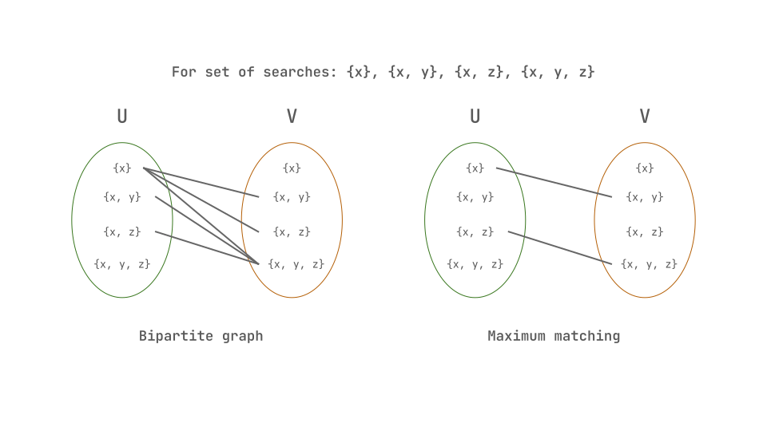
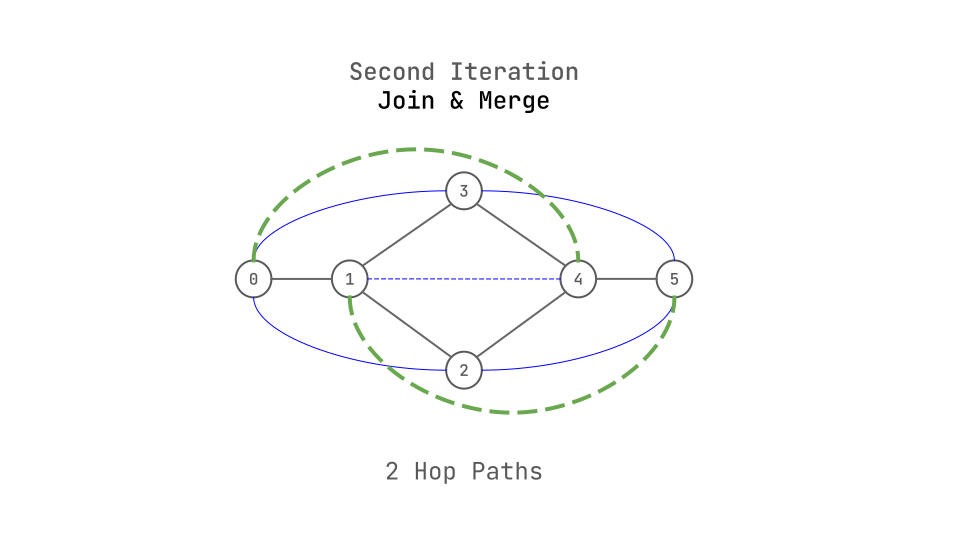

+++
title = 'Souffle Auto Index'
date = 2024-06-14T10:57:38-05:00
tags = ['datalog']
draft = false
[params]
    math = true
+++
<!-- # Auto Indexing in Datalog -->
## Introduction
[Datalog](https://en.wikipedia.org/wiki/Datalog) rules are a bunch of relational queries, each involving of joins over multiple relations. Here is a simple example of a Datalog rule:

```prolog
path(x, y) :- path(x, z), edge(z, y).
```
The above query does Transitive closure over a graph, where `path` and `edge` are relations. The query is saying, if there is a path from `x` to `z` and there is an edge from `z` to `y`, then there is a path from `x` to `y`. This query involves a join over `path` and `edge` relations. [Larger programs](https://github.com/harp-lab/brouhaha/blob/master/analyze.slog) can have 100's of such queries, each involving joins over multiple relations.

For these queries to be performant, you need indexes to make the value look-ups faster and avoid linear scans of the tables.

Well, How do you go about creating the indexes?, Is there a general way that is optimal?. What considerations do you need to take into account when creating indexes?.

This is the paper, that sets up the [Minimum Index Selection Problem](https://souffle-lang.github.io/vldb19.html). The goal of the paper is, given a set of searches that are performed over a relation, figure out the minimum number of indices possible, such that every search is covered by an Index.

### How does a sample problem look like?
- **Input**
    - A relation R, has n columns, of those 3 are being used in different searches, `x, y, z`.
    - The input for the problem is the set of searches being used on a relation, `{x}, {x,y}, {x,z}, {x, y, z}`
    - To enable, performant look-up of these searches, you need to create indexes on the relation for these columns. Naively, at most 4 indexes are needed as there are 4 searches.
- **Problem**
    - Can you get away with fewer indexes without any linear scans of the table?
- **Observations/Note's**
    - "For example, the index \( \ell = x \prec y \prec z \) covers three primitive searches: \( S_1 = \sigma_{x=v_1} \), \( S_2 = \sigma_{x=v'_1, y=v'_2} \), and \( S_3 = \sigma_{x=v''_1, y=v''_2, z=v''_3} \)".
    - You can share indexes among searches, if the searches share a common prefix. For example, if you have searches `{x}, {x,y}`. You can create an index for \(x \prec y\) and use it for both searches.
    - Taking this a bit further, you can see, `{x}, {x, y}, {x, y, z}`, can share one index, \(x \prec y \prec z \) and `x,z` needs a separate index. Or another possibility is `x`, `x,z` and `x,z,y` share an index, and `x,y` a separate index.
    - Here you can intuitively see that you can get away with fewer indexes than the number of searches, by just finding the longest common prefixes among the searches.
- **Solution**
    - This finding the longest prefixes among the searches to cover all searches as to figure a minimum number of indexes is a simple definition of the Minimum Index Selection Problem(MISP).
    - As the paper reveals, this problem can be modelled as Minimum Chain Cover Problem(MCCP), which can be solved in polynomial time.
    - Hence, Our MISP too, can be solved in polynomial time.
    - As does the paper, we will look at the problem and the solution in more detail in the following sections.
## Details
### Definitions
- **Primitive Search** : A primitive search is like a SQL select statement that return tuples which satisfy a condition. For example, a equality check on a column, \( \sigma_{x=v} \) is a primitive search. 
- **Index** : An Index here refers to a clustered B-Tree index that covers a searach predicate. Index, \( \ell = x \prec y \prec z \) uses \( x \) followed by \( y \) followed by \( z \) as its key, and covers searches that share a common prefix with the index.
- **Search Chain** : "A sequence of \( k \) searches \(S_1, S_2, \ldots, S_k \) form a search chain if each search \( S_i \) is a proper subset of its immediate successor \( S_{i+1} \). As a result, all search in the same search chain can be covered by a single index."

### Content
Hopefully, I did a good job of explaining what, the problem we are trying to solve is and some intuition about how the paper looks to solve it.

#### Why not just create an index for each search?
- Well, you can, but that is super expensive both memory and compute, and you can do much better.

#### Why not just look through all the searches and figure the minimal set?
- Well, again you can, but this borders on not possible due to sheer number of possible combinations. The number of possible combinations is something like \( 2^{m!} \), where \( m \) is the number of columns used for searches over a relation.
- When you have \( m \) attributes involved, you have \( m! \) possible permutations of the attributes for an index. And then, out of the \( m! \) permutations, have to choose a minimal set of indexes that cover all searches, i.e., an index can be included in the set or not, and that leads to \( 2^{m!} \) possible combinations.
- The above is a simplification, Section 5.1 of the paper goes into more details.

#### What is MISP again?
- MISP is the Minimum Index Selection Problem, given a set of searches over a relation, need to figure out the minimum number of indexes to cover all searches.
- Take a set of searches \( \mathcal{S} \), and create a set of _search chains_ \( \mathcal{C} \), such that every search in \( \mathcal{S} \) is covered by a search chain in \( \mathcal{C} \).
$$ \text{c-cover}_S(\mathcal{C}) = \forall S \in \mathcal{S} : \exists C \in \mathcal{C} : S \in C. $$
- Now, This looks like a Minimum Chain Cover Problem(MCCP), i.e., Given a partial order, find the minimum number of chains that cover all elements. 

#### How do you solve MISP?
- We saw that MISP can be modelled as MCCP, and MCCP can be solved optimally in polynomial time by Dilworth's Theorem.
- Dilworth's Theorem states that "... in a finite partial order, the size of the maximum anti-chain is equal to the minimum number of chains needed to cover its elements."
- Here, anti-chain is a subset of a poset,such that no two elements are related. And, a chain is a subset of a poset, that forms a total order.
- MCCP can be solved either via the maximum matching problem in bipartite graphs or via the maximum flow problem in networks.
- Here are the details,
    - To compute a minimum chain cover for a set of searches, you create a bi-paritite graph, \( G_s = (U, V, E) \), where \(U\) and \(V\) are the set of searches and \( E \) is edge from \(U\) to \(V\), if the search \(u\) in \(U\) is a subset of the search \(v\) in \(V\).
    - From the bi-partite graph, you have to [compute a maximum matching](#how-to-compute-a-maximum-matching), which is largest set of edges such that no two edges share a vertex.
    - A matching is a subset of edges, such that no two edges share a vertex, or each vertex in \(U\) and \(V\) appears at most once.
    - Once you have the maximum matching, you can create the search chains, by following the edges in the matching.
    - The number of search chains is the minimum number of indexes needed to cover all searches.

#### How to compute a maximum matching?
- Maximum Matching can be computed using Hopcroft-Karp algorithm.
- At a super high level, there are three steps to the algorithm, and we will use the same running example as the paper does to explain.
 $$ \mathcal{S} = \{x\}, \{x,y\}, \{x,z\}, \{x,y,z\} $$
- First step is create a bi-paritite graph, \( G_s = (U, V, E) \) from \( \mathcal{S} \).

- 
- Well, this is an image.



